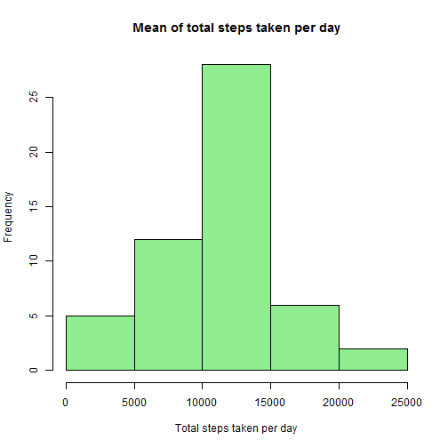
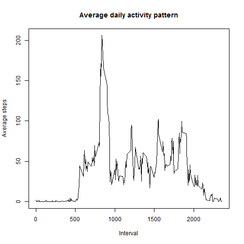
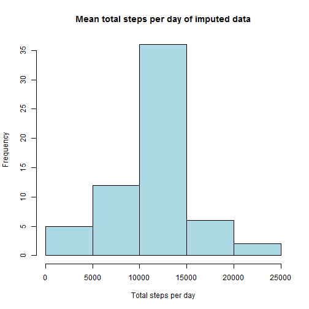

# Reproducible Research: Peer Assessment 1


```r
opts_chunk$set(echo=TRUE)
```
## Loading and preprocessing the data

```r
## Extract file from zip file
unzip("activity.zip")
## set column classes and read file into data frame
cClass <- c("numeric", "Date", "numeric")
activityDf <- read.csv("activity.csv", colClasses=cClass)
## Remove NAs
activityComplete <- na.omit(activityDf)
```


## What is mean total number of steps taken per day?

```r
## Calculate total number of steps each day
totStepsEachDay <- aggregate(steps ~ date, data=activityComplete, FUN=sum)
## Plot histogram
hist(totStepsEachDay$steps, xlab="Total steps taken per day",
                 main = "Mean of total steps taken per day", col="light green", 
                 border="black")
```

 

```r
## Calculate and report Mean of total number of steps each day
meanOfSteps <- mean(totStepsEachDay$steps)
meanOfSteps
```

```
## [1] 10766
```

```r
## Calculate and report Median of total number of steps each day
medianOfSteps <- median(totStepsEachDay$steps)
medianOfSteps
```

```
## [1] 10765
```
Mean of total steps taken each day = **1.0766 &times; 10<sup>4</sup>**

Median of total steps taken each day = **1.0765 &times; 10<sup>4</sup>**

## What is the average daily activity pattern?

```r
## Calculate average steps in interval averaged across all days
activityPattern <- aggregate(steps ~ interval, 
                             data=activityComplete, FUN=mean)
plot(activityPattern$interval, activityPattern$steps, type="l", xlab="Interval",
     ylab="Average steps", main="Average daily activity pattern")
```

 

```r
## Calculate and report the interval that on average across all days has max
## number of steps
intervalMaxSteps <- activityPattern[which.max(activityPattern[, 2]), 1]
intervalMaxSteps
```

```
## [1] 835
```
Interval, that on average across all days contains maximum number of steps = **835**

## Imputing missing values

```r
## Calculate and report total number of rows with NAs
rowsWithNAs <- nrow(activityDf[!complete.cases(activityDf), ])
rowsWithNAs
```

```
## [1] 2304
```
Total number of missing values or number of rows with missing values = **2304**

For imputing missing data, the strategy chosen for the purpose of this assignment is mean of steps taken in an interval calculated across all days. This is one of the stragies recomended in the assignment.

```r
## This function replaces missing values with mean of steps taken per interval
## across all days.
## As per instructions, this function follows one of the suggested stragies
## to replace missing values, which is to use mean of steps taken per interval
## across all days.
replaceMissing <- function() {
        for(i in 1:nrow(activityDf)) {
                thisRow <- activityDf[i,]
                if(!complete.cases(activityDf[i,])) {
                        activityDf[i,]$steps = 
                                activityPattern[activityPattern$interval 
                                                == thisRow$interval, 2]
                }
        }
        activityDf
}
activityMissingReplaced <- replaceMissing()
## Calculate total number of steps per day of imputed data
totalStepsi <- aggregate(steps ~ date, data=activityMissingReplaced, FUN=sum)
## Histogram of total steps per day
hist(totalStepsi$steps, xlab="Total steps per day",
     main = "Mean total steps per day of imputed data",
     col="light blue", border="black")
```

 

```r
## Calculate and report mean of toal number of steps per day of imputed data
meanStepsi <- mean(totalStepsi$steps)
meanStepsi
```

```
## [1] 10766
```

```r
## Calculate and report median of toal number of steps per day of imputed data
medianStepsi <- median(totalStepsi$steps)
medianStepsi
```

```
## [1] 10766
```
Mean of total steps taken each day in imputed data = **1.0766 &times; 10<sup>4</sup>** 

Median of total steps taken each day in imputed data = **1.0766 &times; 10<sup>4</sup>**

These values are similar to the values obtained on the estimate earlier for data set that had NAs removed.
There is no impact of imputing missing values on estimates of total daily number of steps since the strategy to replace missing values is to replace them with mean of total steps taken for each interval.  Calculating mean once omitting missing values and then by replacing those missing values by the mean of each interval procuces same result.

## Are there differences in activity patterns between weekdays and weekends?

```r
## Create a vector of weeddays
wdays <- c("Monday", "Tuesday", "Wednesday", "Thursday", "Friday")
## create a vector labeling dates in the dataframe as weekdays or weekends
categorizedDays <- sapply(activityMissingReplaced$date, 
                          function (x) ifelse(weekdays(x) %in% wdays, 
                                              "weekday", "weekend"))
## Bind the vector created above as column named "day" to the dataframe
## that had missing values imputed
categorizedActivityPattern <- cbind(activityMissingReplaced, 
                                    day=as.factor(categorizedDays))
## Calculate average number of steps per interval averaged across all weekday
## days or weekend days
dayTypeActivityPattern <- aggregate(steps ~ interval * day, 
                                    data=categorizedActivityPattern,
                                    FUN=mean)
## Load lattice system and plot number of steps per interval averaged across
## all weekday days or weekend days
library(lattice)
xyplot(steps~interval|day,
       data=dayTypeActivityPattern, index.cond=list(c(1,2)), type="l",
       layout=c(1,2), xlab="Interval", ylab="Number of steps")
```

 
